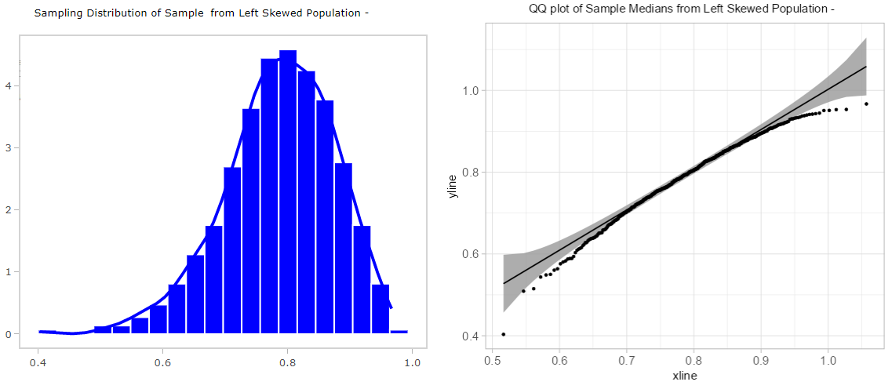
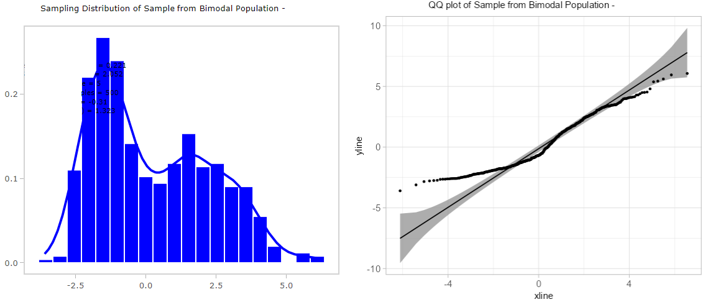
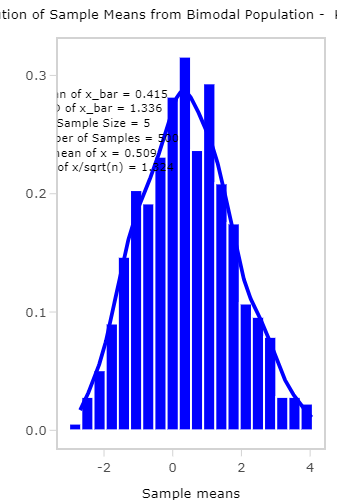

```{r setup, include=FALSE}
knitr::opts_chunk$set(echo = TRUE)
```

# Your Name: Kyle Tranfaglia

# Introduction

If we want to estimate a parameter of population - say, the mean of population - we can use a mean of a sample for our estimate. Imagine we have several different samples of the same size n. Chances are the means of those samples are different, at least some of them. On the other hand, since samples are random, sample means are random as well. Hence, we can look at sample means as values of a random variable and study the corresponding distribution and its properties.

The **sampling distribution** of a statistic (such as a sample mean or sample proportion) is the distribution of all values of the statistic when $\underline{\text{all possible samples}}$ of the same size n are taken from the same population. Sampling distribution of sample mean $\overline{X}$ has the following properties:

1.  If the sampled population has a finite mean $\mu$, then the mean of the sampling distribution of $\overline{X}$, $\mu_{\overline{X}}$, equals the mean of the sampled population, $\mu$. That is $\mu_{\overline{X}}=E[X]=\mu$.

2.  If the sampled population has a finite standard deviation $\sigma$, then the standard deviation of the sampling distribution of $\overline{X}$ equals $$
    \frac{\text{standard deviation of sampled population}}{\text{square root of sample size}},
    $$ that is $\sigma_{\overline{X}}=\frac{\sigma}{\sqrt{n}}$.

In addition to the properties above, describing mean and standard deviation of the sampling distribution of sample mean, in certain cases we know the shape of sampling distribution. We will see later how useful those fact can be.

The theorem summarizing shape and parameters of sampling distribution is called the **Central Limit Theorem**. There are many variations of the Central Limit Theorem. in this course we are going to use the following two:

-   The sampling distribution of $\overline{X}$ will be normal with mean $\mu_{\overline{X}}=E[X]=\mu$ and standard deviation $\sigma_{\overline{X}}=\frac{\sigma}{\sqrt{n}}$, provided that a random sample of $n$ observations is selected from a population with a normal distribution with population mean $\mu$ and population standard deviation $\sigma$.

-   The sampling distribution of $\overline{X}$ will be approximately normal with mean $\mu_{\overline{X}}=E[X]=\mu$ and standard deviation $\sigma_{\overline{X}}=\frac{\sigma}{\sqrt{n}}$, provided that a random sample of **sufficiently large** $n$ observations is selected from **any** population with a finite population mean $\mu$ and a finite population standard deviation $\sigma$.

Notice that statements of both versions of the Central Limit Theorem are the same, but assumptions are different. In one, normality of the "parent" or sampled distribution is required. The other version is valid for any (with finite population mean and standard deviation) distribution of the "parent" distribution as long as sample is large enough. For most sampled population, sample sizes of $n\geq 30$ will suffice for the normal approximation of sampling distribution to be reasonable.

Notice that if the "parent" distribution is different from normal and sample is small (less than 30), or non-normal with infinite mean and standard deviation (even when the sample size is large), then we cannot claim that sampling distribution is normal and parameters, mean and standard deviation, are as stated.

In this lab, we are going to examine the properties of the sampling distribution of sample means and the central limit theorem. We will use a shiny app "CLTapp.R". In the app, we will consider six different types of "parent" distributions. For each distributions, we will explore how does the sample size affects our observations of the discussed properties.

But before we dig into the app, let's learn some preliminary knowledge about checking the normality of a data set, and how to insert images into your R Markdown report.

# Part I: Checking Normality Using Histogram and QQ-Plot

Since the Central Limit Theorem states that when certain assumptions are satisfied, the sampling distribution of sample means will be (or approach to) a particular normal distribution. Thus it is important to know how to check whether a data set (in this lab, the collection of sample means) is from a normal distribution. While more details will be discussed in Lab 7, one simple graphical method for checking the normality is using **histogram** and **QQ-plot**.

In statistics, a histogram is an approximate representation of the distribution of numerical data. A QQ-plot (quantile-quantile plot) is a probability plot, a graphical method for comparing two probability distribution (x-the theoretical normal quantiles, y-the data set quantiles). If a data set is from a normal distribution, then we can expect that its histogram will be **approximately bell-shape**, **AND** the points in the **QQ-plot** will **approximately lie on the identity straight line** $y=x$.

Let's insert the image "QQ_normal.png" to this R Markdown file as an example. Before you insert the image, make sure it is in the SAME folder with this R Markdown file.

To add images to an R markdown file (when the image is in the same folder), we can use the following syntax

```         

```

So, in our case, directly type the following outside any chunk. Then click "Visual" on the left-top corner, then click it again.

```         

```


You can see that histogram (on the left-hand side) is approximately bell-shape and the points in the QQ-plot (on the right-hand side) approximately lie on the straight line. So we can conclude that the data approximately follows a normal distribution

## Assignment 1

Now, insert the images "QQ_rightskewed.png", "QQ_leftskewed.png", "QQ_bimodal.png", and "QQ_cauchy.png". Then describe your observations on the histograms and QQ-plots, and determine whether the corresponding data set is from a normal distribution.

1.  Insert "QQ_rightskewed.png" below.


Describe your observation below.

```         
The histogram and the qq plot indicate a right-skew data set as the histogram displays a greater range of data on the right of the majoity of the data and the qq plot shows points shifting away from the line, above it.
```

2.  Insert "QQ_leftskewed.png" below.

    

Describe your observation below.

```         
The histogram and the qq plot indicate a left-skew data set as the histogram displays a greater range of data on the left of the majoity of the data and the qq plot shows points shifting away from the line, below it.
```

3.  Insert "QQ_bimodal.png" below.

Describe your observation below.



```         
The histogram and the qq plot indicate a bimodal data set as the histogram displays a data set with two local maximas and the qq plot shows points shifting away from the line, both below and above.
```

4.  Insert "QQ_cauchy.png" below.

Describe your observation below.


```         
The histogram and the qq plot indicate a cauchy data set as the histogram displays a very large portion of the data to be approximately the mean such that the sd is very low and the qq plot shows points shifting away from the line, above and below with a great shift for low and high vales on the x-line.
```

**End of Assignment 1**

# Part II: Sampling Distributions of Sample Means: When Assumptions are Satisfied

Recall the assumptions needed to observe the properties of sampling distribution of sample means"

1.  The "parent" population has a finite mean $\mu$

2.  The "parent" population has a finite standard deviation $\sigma$

3.  a\. The "parent" population follows a normal distribution (then sample size $n$ doesn't matter), OR

    b\. The "parent" population can be any distribution, as long as assumptions 1 and 2 are satisfied, and the sample size $n$ is sufficiently large ($n\geq 30$ for most of the cases).

Let's use the **Shiny Web App** "CLTapp.R" to explore the properties of sampling distribution of sample means.

Double click that file, and click the "Run App" button on the top of the editor. You should be able to see the following app window.


**TYPE YOUR NAME AND DATE IN THE TEXTBOX ON THE LEFT-BOTTOM CORNER**

Let's take a look at the app. On the left-hand side, you can select the population distribution ("parent" distribution) that you want to sample from. You can also change the sample size (how many values in ONE sample) and the number of samples (how many times to repeat the sampling).

On the right-hand side, there are several tabs on the top. The first one "Population Distribution" present the histogram of the "parent" distribution (approximated by a sample with size of 300000). Move your mouse to the graph, you can see several icons pop up on the right-top corner. Click the first one "Download plot as a png", save the plot to the SAME folder with this R Markdown, then you can insert the image to this Markdown report, as you did in assignment 1.

The second tab "Plots of First Eight Samples" present the dotplots of the first 8 samples from the distribution. You can change the sample size and the population distribution and see how the dotplots changes correspondingly.

The third tab "Sample Details" presents the details values and statistics from the computer simulations. Each column represents ONE sample (and the 8 dotplots in the second tab are from the first 8 column here). You can see the detailed values in each sample (value 1, 2, etc.), Based on the values in each column, you can compute the sample mean/median/standard deviation (presented on the first three rows). If you have 100 samples, then you can obtain 100 sample means/medians. Then based on these 100 sample means (or medians), you can plot their histogram and QQ-plot (presented on the forth and the fifth tabs).

Based on the app, we can now explore the properties of sampling distribution of sample means by going over the following assignments.

## Assignment 2

1.  Set the Population Distribution as "Normal", the Sample Size as 5, and the Number of samples as 500.

2.  Go to the "Population Distribution" tab, download the distribution plot and name it as "pop_normal.png", then insert the image below.

3.  Based on the population distribution plot, answer the questions: what is the mean and standard deviation of this "parent" distribution, does it satisfy the assumptions? (specify which conditions are satisfied, especially 3a or 3b)

    {width="547"}

    ```         
    mean = 0, sd = 0.998. All assumptions are satisfied, 3a is satisfied. This is a normal distribution so n does not matter and there is a finite mean and sd.
    ```

4.  Go to the "Sampling Distribution - Sample Mean" tab, download the histogram and QQ-plot (for QQ-plot, you may need to right click you mouse on that plot, and click "Save image as..."). Name the plots as "sample_hist_normal_n5.png" and "sample_qq_normal_n5.png" (n5 means sample size n=5). Then insert the plots below

     {width="267"}

5.  Based on the histogram and QQ_plot, answer the questions: what is the mean and standard deviation of $\overline{X}$? Do they (approximately) equal to the population mean and $\sigma/\sqrt(n)$, respectively? Based on the histogram and QQ_plot, determine whether the sampling distribution of sample means is approximately normal distributed.

    (In the case when the calculation results on the histogram are covered by the image, move you mouse to the plot, use the "pan" pop-up icon and/or "zoom in" pop_up icon to get a clearer view)

    ```         
    xbar mean = 0, xbar sd = 0.425. mean of x = 0, sd of x = 0.448. The means and sds are approximately equal. We can conclude that the sampling distriution of sample means is approximately normally distributed.
    ```

6.  Keep the Population Distribution as "Normal"and the Number of samples as 500. But change the Sample Size to 30 and 100. Then answer questions 4 and 5 respectively. (when you download the plots, make sure to adjust the name to n30 and n100, respectively)

       

    ```         
    
    
    
    
    ```

7.  Comparing results on questions 4, 5, and 6. How does the sample size affect the results?

    ```         
    Using the results from the distribution data with varying sample sizes, we can conclude that the curve represented by the data becomes more normally distributed as the sample size increases. Additionally, we can note a decrease in sd as the sample size increases.
    ```

**End of Assignment 2**

The above is the case when the "parent" distribution is already normal. Next, let's consider the cases when the "parent" distribution is non-normal.

## Assignment 3

Set the Population Distribution to "Uniform", "Right Skewed", "Left Skewed", and "Bimodal". Then Answer all questions in Assignment 2 for EACH Population Distribution, respectively.

Type \### to specified the population, for example

```         
### Uniform Pop Distribution





```

### Uniform Pop Distribution


```         
mean = 0.501, sd = 0.289. The uniform distribution does not satisfy the assumptions. It has a finite mean and sd, but the sample size n < 30.
```

### Uniform Sample Distributions     

```         
xbar mean = .503, xbar sd = 0.135. mean of x = .501, sd of x = 0.129. The means and sds are approximately equal. We can conclude that the sampling distriution of sample means is approximately normally distributed.

Using the results from the distribution data with varying sample sizes, we can conclude that the curve represented by the data becomes more normally distributed as the sample size increases. Additionally, we can note a decrease in sd as the sample size increases.
```

### Right-skew Pop Distribution


```         
mean = 1.134, sd = 0.606. The right-skew distribution does not satisfy the assumptions. It has a finite mean and sd, but the sample size n < 30.
```

### Right-skew Sampling Distributions     

```         
xbar mean = 1.151, xbar sd = 0.29. mean of x = 1.134, sd of x = 0.279. The means and sds are approximately equal. We can conclude that the sampling distriution of sample means is a rigt-skew.

Using the results from the distribution data with varying sample sizes, we can conclude that the curve represented by the data becomes more normally distributed as the sample size increases. Additionally, we can note a decrease in sd as the sample size increases.
```

### Left-Skew Pop Distribution


```         
mean = 0.769, sd = 0.154. The left-skew distribution does not satisfy the assumptions. It has a finite mean and sd, but the sample size n < 30.
```

### Left-Skew Sampling Distributions     

```         
xbar mean = 0.768, xbar sd = 0.064. mean of x = 0.769, sd of x = 0.069. The means and sds are approximately equal. We can conclude that the sampling distriution of sample means is a left-skew.

Using the results from the distribution data with varying sample sizes, we can conclude that the curve represented by the data becomes more normally distributed as the sample size increases. Additionally, we can note a decrease in sd as the sample size increases.
```

### Bimodal pop Distribution


```         
mean = 0.509, sd = -0.314. The bimodal distribution does not satisfy the assumptions. It has a finite mean and sd, but the sample size n < 30.
```

### Bimodal Sampling Distributions     

```         
xbar mean = 0.415, xbar sd = 1.336. mean of x = 0.509, sd of x = 1.324. The sds are approximately equal but there is a small differene in mean. We can conclude that the sampling distriution of sample means is a bimodal distribution.

Using the results from the distribution data with varying sample sizes, we can conclude that the curve represented by the data becomes more normally distributed as the sample size increases. Additionally, we can note a decrease in sd as the sample size increases.
```

Then insert the images below that.

To add a textbox to answer the question, type \`\`\`, then hit enter.

**End of Assignment 3**

# Part III: Sampling Distributions of Sample Means: When Assumptions are NOT Satisfied

In part II, the "parent" distributions we selected in fact satisfied the assumptions needed for the Central Limit Theorem. But what if one or some of the assumptions are not satisfied? Will the Central Limit Theorem still hold? Let's consider a particular distribution: **Cauchy Distribution**.

One interesting facts about Cauchy distribution is that, it does NOT have defined mean or standard deviation, thus assumptions 1 and 2 are not satisfied. Let's explore the properties of the sampling distribution of sample means by completing the following assignment.

## Assignment 4

Set the Population Distribution to "Cauchy". Then Answer all questions in Assignment 2

```         


```

### Cauchy Pop Distribution


```         
mean = undefined, sd = undefined. The cauchy distribution does not satisfy the assumptions. It has an undefined (not finite) mean and sd and the sample size n < 30.
```

### Cauchy Sampling Distributions     

```         
xbar mean = -1.132, xbar sd = 46.76. mean of x = 1.554, sd of x = 194.35. Neither the mean or sd are equal and vary greatly. We can conclude that the sampling distriution of sample means is a cauchy distribution.

Using the results from the distribution data with varying sample sizes, we can conclude that the curve represented by the data does not become more normally distributed as the sample size increases and rather, the distribution remains a cauchy distribution.
```

**End of Assignment 4**

So, what can we do when assumption 1 and/or 2 are not satisfied? Interestingly, we can have a "Central Limit Theorem" for **Sample Medians** (we are dealing with sample means only by far). Of course, the sample medians version CLT also require OTHER assumptions. We don't go into the details here, but for the case of Cauchy, we can say the assumptions are satisfied. In this version, the mean of the sampling distribution of the sample medians is the population median, and the standard deviation is proportional to $1/\sqrt{n}$.

## Assignment 5

1.  Go to the tab "Sampling Distribution - Sample Median"

2.  Set the Population Distribution as "Cauchy", Number of samples as 500, then change sample size as 10, 50, 100, and 300 respectively.

3.  For each selected sample size, download the histogram and QQ-plot, then insert below.

           

4.  For each selected sample size, compare the "mean of samp_median" and "median of x" on the histogram. Then check if the "Ratio of 2nd and 6th line" are approximately equal to each others for different sample size. What is your observations.

    ```         
    The ratio of the second and sixth line are approximately equal for larger values of n, such as n = 300. It appears that as n increases, the ratios become closer to equality. The ratios for n = 10 and n = 50 are not approximately equal but n = 100 is about equal and we can say n = 300 is approximately equal.
    ```

5.  For each selected sample size, is the sampling distribution of sample median approximately normal? How does the sample size increasing affect the normality approaching?

    ```         
    For smaller n values, such as n = 10 and n = 50, the sampling distribution of sample median is not approximately normal, and rather keeps a cauchy data structure, however for larger values of n such as n = 100 and especially n = 300, the medians are approximately normal. Therfore, we can conclude from the data set that as sample size n increases, the sampling distribution of sample median for a cauchy data set approaches normality as the sample size increases.
    ```

**End of Assignment 5**

# Part IV: Knit this markdown file to a html report

After you complete all the above assignments, click the Knit button to create a html report. Submit that html report.
